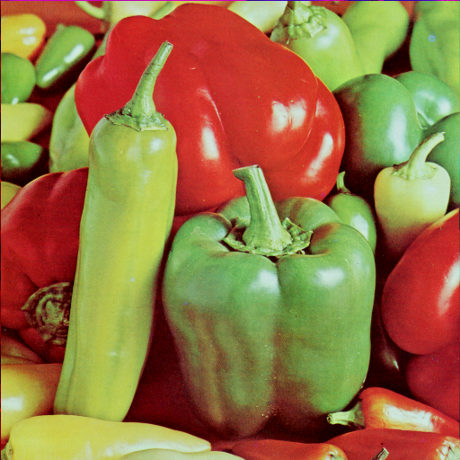
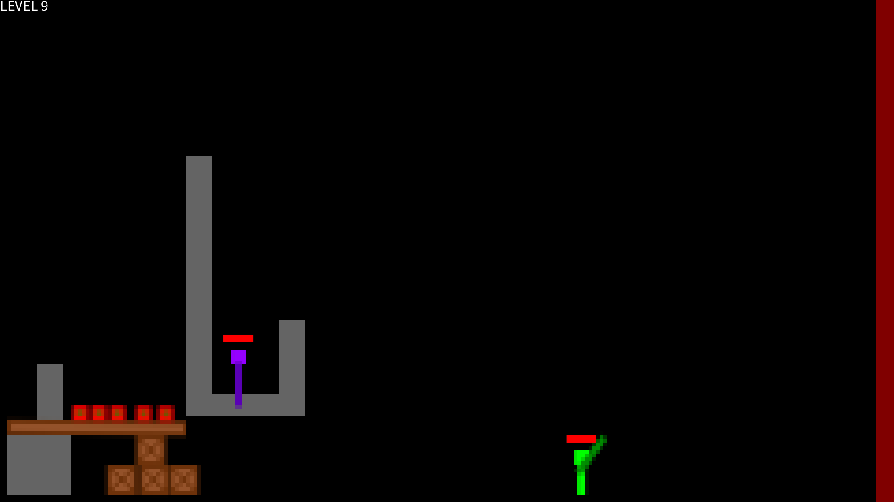

# MEDIART 206: Computer Graphics Projects

This repository contains a portfolio of computer graphics projects by Yuxiang Lin for the MEDIART 206: Computer Graphics course using [Processing](https://processing.org/). These projects explore a wide range of concepts in generative art, data visualization, game physics, and procedural generation.

# 1. Programming Contest Club Poster

A poster designed for the DKU Programming Contest Club, blending a "geeky" aesthetic with humor.

* **Generative Graphics:** All graphical elements are rendered on a custom-built **hexagonal grid**, creating a unique abstract, pixel-art-like style.
* **Concept-Driven Design:** The main text element is a C-style 'if' statement, complete with 'leetspeak' references and code-editor-inspired fonts (Brass Mono) and color palettes (Tomorrow).
* **Custom Tooling:** Wrote custom utilities for managing hexagonal coordinates, drawing shapes, and rendering text on the grid.

  

# 2. Wavy Illusion Field

A generative art piece that recreates and experiments with the "Primrose's field" optical motion illusion.

* **Algorithmic Art:** Systematically iterated on generative rules, exploring how different patterns, shapes (squares vs. crosses), and sizes contribute to the illusory effect.
* **Mathematical Concepts:** The final implementation uses the **Thue-Morse sequence** to generate the corner patterns, resulting in a strong and compelling wavy, motion-like illusion.
* **Animation:** The final piece is colorized and animated, with the pattern shifting to enhance the perceptual effect.

  

# 3. Recursive Reconstruction of Images

A novel implementation of the **Wave Function Collapse (WFC)** algorithm, modified to iteratively reconstruct images from simple patterns to complex forms.

* **Algorithmic Modification:** Deviates from standard WFC by using a probabilistic placement model based on **Bayes' theorem** rather than strict tile-adjacency rules.
* **Stochastic Sampling:** Implements a **weighted random sampling** method for tile placement (weighted by entropy) to prevent deterministic, monolithic outputs and encourage more varied, organic results.
* **Procedural Generation:** The algorithm generates a new image by sampling the original at progressively larger tile sizes (e.g., $1 \times 1$, $4 \times 4$, $16 \times 16$), inspired by procedural noise-layering techniques.

  
  
  
  

# 4. Illegible Black Metal Band Logo Generator

A generative typography project that procedurally creates "unintelligible" black metal logos, parodying the genre's aesthetic.

* **Agent-Based System:** Built using two types of agents (`Trunk` and `Branch`) that "draw" the logo in real-time.
* **Procedural Animation:** `Trunk` agents draw the base font using **Bézier curves** for smooth, pen-like strokes. `Branch` agents emerge and "flow" based on a vector field.
* **Vector Field Generation:** The "blood-dripping" and "tree-branching" effects are achieved by moving agents along a gradient field composed of a **2D noise gradient**, a random gradient, and a downward Y-shift. The system also supports recursive branching.

  
  

# 5. Chinese Income Visualization

A three-part data visualization project exploring 2018 income, industry, and working-hour data from the China Family Panel Studies (CFPS).

* **Data Analysis:** Used Python (Pandas, Matplotlib) to process, analyze, and visualize the dataset.
* **Novel Chart Design:** Created a **hybrid stacked bar/bump chart** to simultaneously show the number of workers and the ranking of industrial sectors across different income levels.
* **Statistical Visualization:** Implemented a scatter plot of working hours vs. income, complete with a **linear regression** best-fit line to highlight trends in the data.

  

# 6. Game: Infernoxene

A 2D side-scrolling action-puzzle game where the core mechanic is using fire and physics to eliminate enemies. The game, physics engine, and tools were built from scratch.

* **Custom Physics Engine:** Features a hybrid system combining:
    * **Falling Sand Physics:** A cellular automata simulation for fluids like oil and fire propagation.
    * **Rigid Body Physics:** A custom-built system with a **sequential impulse solver** for collisions.
* **Complex Game Systems:** Implemented player controls (movement, grabbing, throwing), enemy AI (including a "sentry" type that uses the game's own mechanics), health systems, and a complete game loop across 16 levels.
* **Game Development Tools:** Wrote a complete **level editor** to create, save, and load game levels, demonstrating a full-stack approach to game creation.

  
  
  

# Extra: Abstract 3D Plant Based on L-system

An extra-credit project demonstrating procedural 3D modeling of a plant using L-systems.

* **Generative Algorithm:** Uses an **L-system** (a parallel rewriting system) to generate a string representing the plant's structure (apices, branches, leaves, flowers).
* **Procedural Animation:** The plant's "growth" is animated by applying **stochastic rewriting rules** each frame, simulating cell division and elongation.
* **3D Graphics:** Renders the resulting structure in 3D using turtle graphics logic.

  

