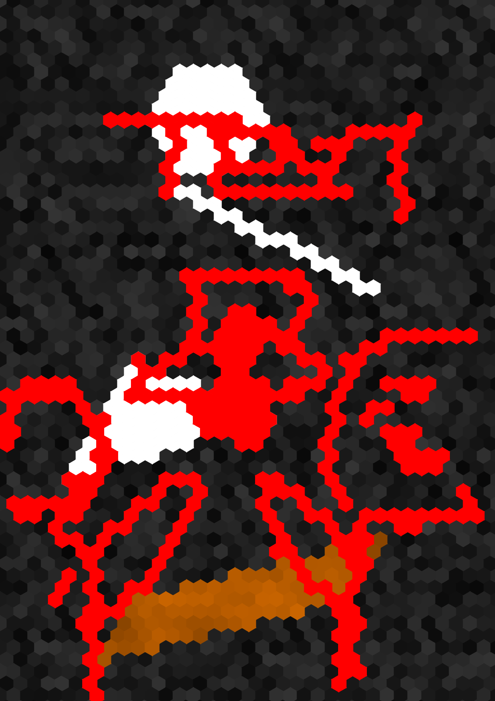
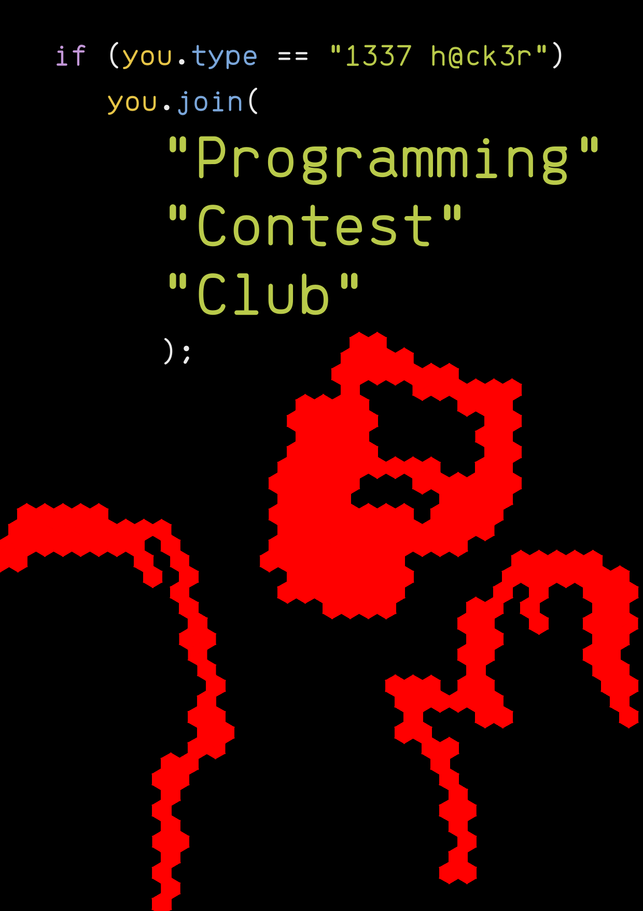
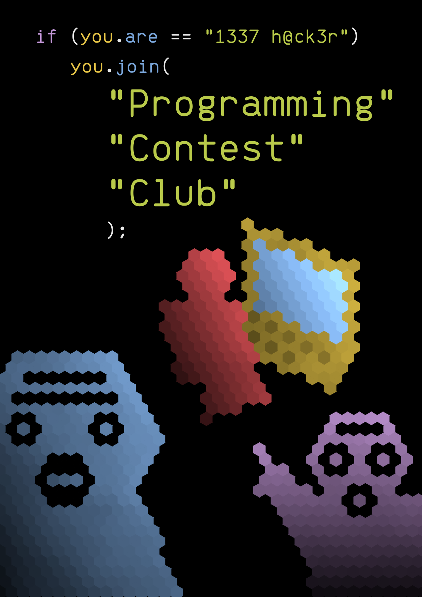

# Programming Contest Club Poster

## Concept

### Brief

This is a poster which my club (DKU Programming Contest Club) could use during a Club Expo. Our club's mission is to take part in programming contests. Therefore, the poster should convey a geeky impression, but also not without a sense of humor. The poster may be both stuck to the walls and handed out, so the aspect ratio for an A series paper in portrait orientation is chosen.

### Text Element

The text element uses a "coded text" design, which is basically an if statement in C-style code saying that "if you are an elite hacker, you should join the Programming Contest Club." It also references the "leetspeak" trope with "1337 h@ck3r" standing for "elite hacker." The code highlighting and the extra large "Programming Contest Club" requires manual adjustments to its color and placement. The font I chose is Brass Mono, which is a "retro monospaced font inspired by 70's electrical and mechanical design," and a "solid choice for writing code." Therefore, the choice of this font could give a "programming impression."

### Graphics Element

The most essential feature is that all the graphics are drawn on a hexagonal grid in an abstract fashion similar to a pixel art. The overall layout is inspired by the "two soyjaks pointing" meme, with two persons in the bottom corners of the screen having surprised faces and the person to the right pointing to the center of the poster. This directs the focus to the center of the poster, which is a person sitting in front of the computer screen. (Also note that the "Programming Contest Club" text is directly above it.) The three people featured in this poster represents a typical team in the ICPC programming contest, where three team members have to share one computer. The vibrant Tomorrow color palette (which is also a color palette for code text editors) is used in this poster. The careful placement of different colors is able to give a sense of balance. Gradients and noises are added to provide the finer details.

## Iterations

### Iteration 1

I implemented utilities for working with hexagonal coordinates and drawing basic shapes in a hexagonal grid. A random hexagonal grid and some shapes are drawn for testing. I also used a "pencil" tool (which also shows the current hexagonal coordinate) to draw some sketches for text and graphics placements.

{width=6cm}

### Iteration 2

I implemented a utility for drawing texts with different colors before using it to draw highlighted code texts.

{width=6cm}

## Final result

The coder sitting in front of the computer and the two soyjaks pointing at them is added. I used callback functions passed to the shape functions to produce the gradient and noise details.

{width=15cm}

## References

* Hexagonal grid: https://www.redblobgames.com/grids/hexagons
* Hexagonal coordinate tricks: https://observablehq.com/@jrus/hexround
* Triangle drawing algorithm: https://github.com/ssloy/tinyrenderer/wiki/Lesson-2:-Triangle-rasterization-and-back-face-culling#old-school-method-line-sweeping
* Brass Mono font: https://github.com/fonsecapeter/brass_mono
* Tomorrow theme: https://github.com/chriskempson/tomorrow-theme
