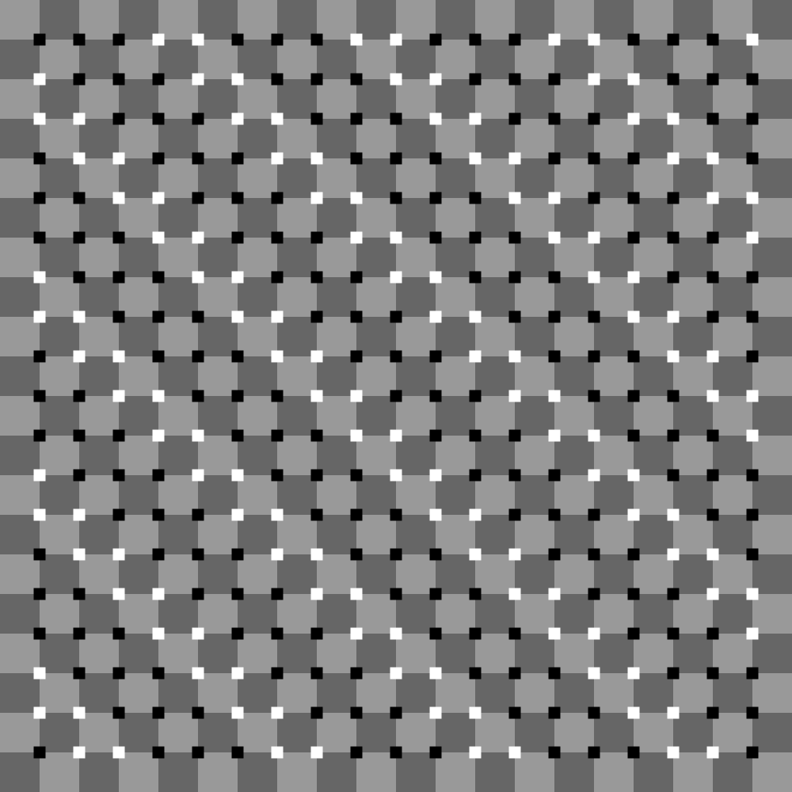

# Wavy Illusion Field

## Concept statement

This project aims at recreating and experimenting with an optical motion illusion work named "Primrose's field," which consists of a checkerboard with cross-like shapes of alternating colors placed at the corners of the cells. When looking at Primrose's field, the straight and perpendicular lines appear wavy, and that the illusory motion of the waves could be observed when looking at the different regions of the image.

I will first create a grid of large squares and place the small squares at the corners of the large squares. Then I will manipulate the size, color pattern, and the shape of the small squares to see how will they contribute to the optical illusion and whether I can do better than the original pattern.

## Generative rule

1. A simple checkerboard pattern is drawn in the background with alternating light gray and dark gray patterns.
2. At the corners of the cells in the checkerboard pattern, either a small white square or or a black square could be drawn according to some rules. The "squares" could also be stylized into shapes such as crosses.
3. The pattern could be colorized if needed.

## Design iterations

### Iteration 1

I filled the large squares with light gray and dark gray checkerboard patterns. The small squares are of the same pattern but filled with white and black instead. Then I produced four images with different sizes/shapes for the small squares: large squares, medium squares, small squares, and crosses formed by quadratic curves. From my perspective, no optical illusion is observed with the large square patterns. For the medium and small squares, there is a sight illusion that the lines are slanted instead of being perfectly perpendicular to each other. However, this illusion is most strongly observed with the cross-shaped corners, which hint at the fact that the shape of the cross in the original design might be beneficial in inducing optical illusions.

{width=4cm}
{width=4cm}
{width=4cm}
{width=4cm}

### Iteration 2

I decided to keep the large checkerboard pattern unchanged, but change the small squares to the following pattern shifted to the right every time you go one row down the board:

```
BBBWW BBBWW ...
 BBBWW BBBWW ...
  BBBWW BBBWW ...
...
```

This pattern aims at recreating the alternating diagonal lines in the original Primrose's field and analyze its contribution to the overall illusory effect. There appears to be a wavy pattern in the medium and the small squares version, and this wavy illusion is further amplified in the pattern with cross-shaped corners. Nevertheless, the illusory effect is still weaker than the original Primrose's field and little to no motion could be observed when focusing the eyes at different regions of the image.

{width=4cm}
{width=4cm}
{width=4cm}
{width=4cm}

### Iteration 3

I will now use the original Primrose's field patterns:

```
WBBW BWWB WBBW BWWB ...
 WBBW BWWB WBBW BWWB ...
  WBBW BWWB WBBW BWWB ...
...
```

The wavy lines illusion could be also observed in the medium and the small squares version, with the small squares version having the stronger illusion. The motion illusion can now be observed slightly in the small squares version. As is before, the crosses version have the strongest overall illusory effect, pretty much replicating the effect observed in the original Primrose's field.

{width=4cm}
{width=4cm}
{width=4cm}
{width=4cm}

### Iteration 4

I now shift each row down to the right by two positions:

```
WBBW BWWB WBBW BWWB ...
12WBBW BWWB WBBW BWWB ...
```

This sort of reflects the diagonals vertically, but also looks a bit differently from an actual reflection.

{width=4cm}

Shifting to the right by three positions doesn't look very interesting:

{width=4cm}

Shifting to the right by four positions creates an interesting "funnel" pattern that sort of looks like this:

```
\/\/\/
```

{width=4cm}

Shifting to the right by five, six, and seven positions are just shifting to the left by three, two, and one positions.

{width=4cm}
{width=4cm}
{width=4cm}

### Iteration 5

This is the Primrose's field on a 33x33 grid:

{width=4cm}

Now, instead of the original Primrose's field pattern, I thought that the Thue–Morse sequence is quite similar to it, which looks like this:

```
W
W B
WB BW
WBBW BWWB
WBBWBWWB BWWBWBBW
```

This sequence could be constructed recursively by appending the inverse of itself to itself repeatedly, or by calculating the parity of the binary representation of the indices. It could be observed that the Thue-Morse sequence of length 8 is the same as the original pattern.

I chose to fill the first row with the Thue-Morse sequence and repeatedly shift it to the right by one when going down the rows. This creates the pattern below, which doesn't look very different from the original design at a glance, and the strength of the illusory effect is approximately the same:

{width=4cm}

### Iteration 6

I also tried to fill the small squares with white and black randomly, which creates a rather random distortion.

{width=4cm}

## Final results

I took the Thue-Morse sequence pattern from iteration 5 and colorized it. I also animated this pattern by shifting it to right repeatedly every few frames, but this doesn't appear to have a significant impact on the optical illusions effect.

{width=15cm}

## References

Akiyoshi's illusion pages: https://www.ritsumei.ac.jp/~akitaoka/index-e.html  
Thue–Morse sequence: https://en.wikipedia.org/wiki/Thue%E2%80%93Morse_sequence  
Color palette: https://colorhunt.co/palette/29000187431dc87941dbcbbd
