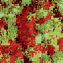
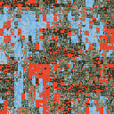

# Recursive Reconstruction of Images

## Concept

This project is based on the wave function collapse algorithm, which places tiles onto a grid according to certain rules such as whether tile A can be placed to the left of tile B. It optimizes this process by placing a tile on the position with the least entropy each time. The entropy of a position is decided by how many different types of tile could potentially be placed at that position (as decided by its neighboring tiles that are already placed). For example, if only one type of tile could be placed at $(x_0, y_0)$, but there could be two types of tile at $(x_1, y_1)$, then $(x_0, y_0)$ has a lower entropy. This, for example, can be used to procedurally generate a image when given a small image. The small image in this case provides both the tiles (chopped-up pieces of the image) and describes the generative rule (what pieces can be placed together in the small image can be placed together in the generated image).

My idea is to tweak the wave function algorithm so that a) the placement of the tiles are not strict, but the way they neighbor each other is similar to the original image and b) I will sample and "reconstruct" the original image iteratively in increasing larger sizes that are powers of 2 (e.g. 1x1, 2x2, 4x4, ...). This is also inspired by the way how procedural textures are created, where layers of noises of various frequencies are added together so that the lower frequency noises form the overall shape, while the higher frequency noises form the details. Put it another way, I would like to create a image that is "similar" to the original in a sense that both the larger chunks and the small pieces in the output image would relate to their neighbors in a way similar to the original image.

Although not intentionally thought of, the way I tweaked the original algorithm could be comparable to glitch art, where technologies are used in ways that deviate from their original designs to introduce glitches. In a similar fashion, I modified the wave function collapse algorithm according an abstract concept of reconstructed a image with progressively larger tiles. The end result also bears similarity to glitch art aesthetically despite the fact that I actually prefer a more smooth looking. The "blocky" output could be explained by that I only consider the average color of a tile instead of how it would connect to its neighbors.

## Generative rule

My project also implements the wave function collapse algorithm which generates a new image from the rules described by the original image, but it deviates from the usual implementation in four aspects:

1. The placement of the tiles do not adhere to strict rules, but the probability of one tile having color A in the generated image is decided only by the probability of a) the overall probability of a tile having color A in the original image and b) the probability of a tile having color A neighboring another tile of color B in the original image when a tile of color B is already placed in the generated image neighboring the given tile. Formally, let the probability to have tile of color A at $(x, y)$ be $p$. Let the probability to randomly select a tile of color A in the original image be $P(A)$. Let the probability for a tile to have color B to the left of a tile of color A be $P(B|A)$, and the same goes for the tile to the right, up, and down of a tile of color A, which are denoted by $P(C|A), P(D|A), P(E|A)$ respectively. Assuming the independence of the joint probability of all the neighboring tiles, $p$ is calculated as follows according to Bayes' theorem:

$$
p = P(A) \frac{P(B|A) P(C|A) P(D|A) P(E|A)}{P(B) P(C) P(D) P(E)}
$$

2. The process of wave function collapse does not always select the position with the least entropy, but the position is selected each time through a weighted random sampling. The weights are the maximum entropy minus the entropy at the current position. This change favors collapsing the positions with a smaller entropy, but avoids the problem of the output being too determined by the initial decision. This problem can be illustrated by an example: Suppose that we always select the position with the least entropy, and that a blue tile is almost always next to a blue tile and a red tile is almost always next to a red tile in the original image. When the initial tile is set to be blue, its neighbors will have the lowest entropies and will be almost always set to blue. This will continue until the image is filled almost entirely by blue.

3. The generated image is of the same dimensions as the original, but the tiles are of progressively larger sizes that are powers of 2 (e.g. 1x1, 2x2, 4x4, ...). For tiles that are larger than 1x1, its color means the average color of its pixels. When placing the tiles, I would first only consider their average colors before finally assign the actual tile randomly from a pool of tiles sharing the same color.

4. The generation process is iterative:

    1. The original image is sampled by 1x1 tiles to calculate the probabilities.
    2. A new image is generated by placing 1x1 tiles of different colors according to the probabilities.
    3. The new image is sliced into 4x4 tiles for the next iteration.
    4. The original image is sampled again by 4x4 tiles, where the average color of each tile will be considered.
    5. A new image is generated by placing the 4x4 tiles generated from the previous iteration.
    6. The process repeats until the desired tile size is reached.

## Design iterations

### Original image


### 1. RGB12

The original image is converted from 24-bit RGB to 12-bit RGB by using only the highest 4 bits for each channel.


### 2. Quantization

The most frequently used 16 colors (excluding those that are too similar to each other) are chosen to form a palette, and the pixels from the original image is replaced with the closet colors from the palette.


### 3. Tilelify

The utility function for grouping pixels into tiles is implemented. Below is a example of grouping pixels into 4x4 tiles like this:

```
1122
1122
3344
3344
```
The upper-leftmost pixel from each tile is extracted to form the image below:


### 4. Wave function collapse by picking the lowest entropy position

In this iteration, I implemented the wave function collapse algorithm by placing a tile on the position with the lowest entropy in each step (see the `peppers_min` folder for more details). This, however, has the problem of the result being too determined by the initial decision as mentioned above.


## Final results

A weighted random approach is used to generate the final result to address the problem encountered in iteration 4. In the final implementation, results from the previous iteration is fed into the current iteration to iteratively "refine" the result. (Nevertheless, the outputs of later iterations tend to become more blocky.) I also added a log to record the order that the positions are collapsed, which is later played as a video.

* Images of the outputs from different iterations: original_image_name/iter_#.png
* Video of the wave function collapse algorithm running: original_image_name/collapse.mkv

*Note: If you zoom into the outputs for a closer look, they might look blurry. This is because interpolation is often used to upscale an image.*

### Peppers

#### Original


#### Outputs of iterations 0 to 5





### House

#### Original


#### Outputs of iterations 0 to 5


### Mandrill

#### Original


#### Outputs of iterations 0 to 5





## Dependencies

* This specific fork of Video Export Library: https://github.com/hamoid/video_export_processing/tree/kotlinGradle
* ffmpeg

## References

* Wave function collapse algorithm: https://robertheaton.com/2018/12/17/wavefunction-collapse-algorithm/
* Color quantization: https://stackoverflow.com/questions/29244307/effective-gif-image-color-quantization
* SIPI Image Database - Misc: https://sipi.usc.edu/database/database.php?volume=misc
