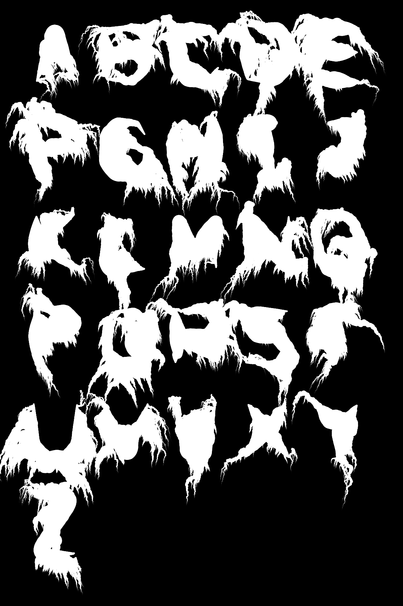

# Illegible Black Metal Band Logo Generator

## Concept

This project aims at recreating the font for stereotypical unintelligible black metal band logos, which could be characterized by the two following features:

1. Tree-like branches emerging from the base text font.
2. Blood-dripping effect along these branches.

These two features can be observed in the logo of the black metal band Darkthrone given below:

{width=4cm}

It should be noted that not all black metal band logos exhibit this style as there are also many bands with clean-looking logos (for example, Emperor). Darkthrone is also not the band with the most unintelligible logo since there are much worse offenders. However, this project simply aims at parodying this "unreadable logo" trope in general.

While these two features could be implemented separately (recursive branching and drawing vertical lines attached to the branches), I took the approach of combining these two features by having the branches bending down gradually like a willow tree.

There are other features that are common in black metal logos. The most prominent is the black and white color, which will be used in this project. Another is the frequent use of Gothic font, which will not be used in this project as I would prefer to draw the base text font on my own using simple strokes and that Gothic fonts are usually used in logos that are clean and engraved-like as opposed to the sprawling tree-like logos that I would generate.

## Generative rule

### Visual object

The visual object is drawn with Agent, which are objects that draw a point (of given stroke) at their current locations and advance their positions every frame. The two types of Agent are:

1. Trunk: Draws the base text font, which contains all the uppercase Latin characters.
2. Branch: Emerges from the base text font to create the branching and blood-dripping effects.

### Parameters

```java
// Scale of the noise xy-coordinates
final float noiseScale = 0.01;

public class Trunk implements Agent
{
    // Maximum time (in frames)
    private static final int   tMax = 300;
    // Stroke weight at beginning and middle
    private static final float swBeg = 15, swMid = 25;
    // Stroke weight interpolation exponent
    private static final float swExp = 1.5;
    // Bezier curve amount at corners
    private static final float smoothAmt = 0.2;
    // Amount of displacement along noise gradient
    private static final float dispScale = 5;
    // Probability to create a new branch
    private static final float branchProb = 0.15;
    // Scale of the branch initial stroke weight
    private static final float branchScale = 1;
    // Minimum and maximum branch length
    private static final float branchLenMin = 150, branchLenMax = 300;
}

public class Branch implements Agent
{
    // Maximum time (in frames)
    private static final int   tMax = 200;
    // Stroke weight interpolation exponent
    private static final float swExp = 0.75;
    // Amount of random gradient added to branch movement
    private static final float randAmt = 0.55;
    // Maximum downward shift
    private static final float yShiftMax = 5;
    // Downward shift interpolation exponent
    private static final float yShiftExp = 3;
    // Maximum branch depth
    private static final int   depthMax = 2;
    // Probability of creating a new branch
    private static final float branchProb = 0.05;
    // Scale of the branch initial stroke weight
    private static final float branchScale = 0.8;
    // Minimum and maximum branch length
    private static final float branchLenMin = 50, branchLenMax = 100;
}
```

### Algorithm

#### Trunk

Each character is defined by a series of strokes, which in turn are line segments connecting a series of points on a 5x5 integer coordinate grid. Below are the two strokes composing an "A" character numbered with 1 and 2:

```
..1..
.1.1.
.222.
1...1
1...1
```

The Trunk Agent linearly interpolates along the sum of all stroke lengths in each frame to render a point from a certain stroke. However, if the current point lies on the corners of a stroke, a Bézier curve would be used to connect the two neighboring line segments smoothly. The stroke weight is also interpolated so that the middle of the stroke has the highest weight while the beginning and the end of the stroke has the lowest. Both the curved corner and the changing stroke weight are for simulating drawing a stroke with a pen.

Displacement is then applied to the points so that they are shifted slightly along the noise gradient, which can be comparable to the jittering of the pen.

Finally there is a random chance every frame that a branch will be created from the current position with the initial stroke weight proportional to the current stroke weight of the Trunk.

#### Branch

The Branch Agent draws a point at its current position and moves forward by a gradient every frame. This gradient is a sum of three vectors:

1. Noise gradient: This can be thought of as extruding the screen along the z-axis to provide a terrain for the branches to "flow" like blood from high to low ground.
2. Random gradient: This allows the branches to grow randomly, providing a tree-like texture.
3. Y-shift: This bends the branches downward gradually. The more the branches extend, the more they will move downward along the Y-axis.

Combining these three vectors gives a mix between tree the tree-branching and blood-dripping effects.

There is also a chance for a branch to recursively create a subbranch every frame, limited by the maximum branch depth.

## Design iterations

### Iteration 1

Lines are drawn along the strokes to compose the characters.

{width=4cm}

### Iteration 2

Stroke weight is linearly interpolated along each stroke.

{width=4cm}

### Iteration 3

Bézier curve is used to smooth out the corners connecting the line segments.

{width=4cm}

### Iteration 4

Trunk object is added. Base text font drawing code is rewritten so that the process of drawing is animated.

{width=4cm}

### Iteration 5

Branch object is added. Branches are created randomly from the base text font toward random directions.

{width=4cm}

### Iteration 6

A 2D noise height map is added and that the gradient at each point is calculated with finite difference. The gradient field is then drawn on the background similar to a normal map with color red for the X component and green for Y component. The branches now move along the gradient field and that a "flowing" texture can be observed.

Stroke weight interpolation is changed to have the thickest part in the middle.

{width=4cm}

### Iteration 7

Random gradient and downward Y-shift are added to Branch so that the branches can have more of the "willow tree" appearance.

Noise gradient displacement is added to the base text font so the text also appears jittered.

Noise scale is adjusted and that the noise is made symmetrical so that it may produce a more symmetrical band logo theoretically (which unfortunately does not appear to work for the alphabet).

{width=4cm}

### Iteration 8

Recursive branching is added.

{width=4cm}

## Final results

### "Default" parameters

This is drawn using the parameters that look the most "correct" to me. (See "Generative rule: Parameters" for the exact parameters.)

{width=15cm}

### Thin beginning and end, fat middle stroke

The following parameters are changed:

```java
// Stroke weight at beginning and middle
private static final float swBeg = 5, swMid = 50;
```

{width=15cm}

### "Convex" branch stroke weight function

The branch stroke weight shrinks increasingly faster:

```java
// Stroke weight interpolation exponent
private static final float swExp = 3;
```

{width=15cm}

### More fluid-like branches

The amount of random gradient is reduced:

```java
// Amount of random gradient added to branch movement
private static final float randAmt = 0.3;
```

{width=15cm}

### "Furry" branches

Recursive branching depth is increased:

```java
// Minimum and maximum branch length
private static final float branchLenMin = 200, branchLenMax = 400;
// Maximum branch depth
private static final int   depthMax = 3;
// Probability of creating a new branch
private static final float branchProb = 0.02;
// Minimum and maximum branch length
private static final float branchLenMin = 100, branchLenMax = 200;
```

{width=15cm}

## References

* Darkthrone logo: https://sk.pinterest.com/pin/426434658442686417
* Extruding a font along a field: https://openprocessing.org/sketch/1989053
* Bézier curve: https://en.wikipedia.org/wiki/B%C3%A9zier_curve
