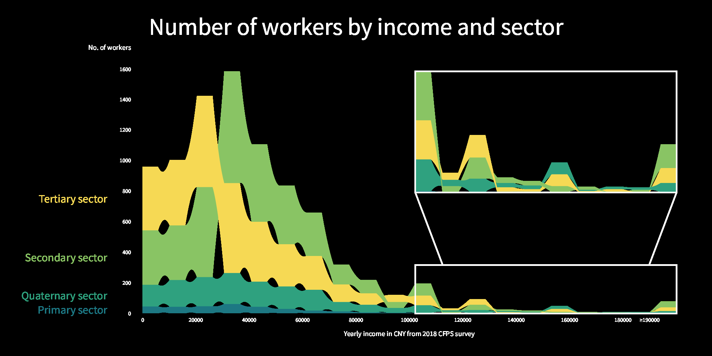

# Chinese income visualization

## Concept

I want to explore the relationship among income, industry, and working hours. As a multitude of relationships would be considered, and that there are many categories of industries (about twenty), I would produce three graphs about this topic:

1. The distribution of income in different industry categories with a histogram for each industry category.
2. The number of workers in different industries at different income levels and how some industry might have more workers than the others at different income levels. As there are numerous industry categories, the four broad divisions of industrial sectors would be used instead. The graph would be a hybrid between stacked bar chart and bump chart.
3. A scatter plot showing how working hours correlates with income level. This could demonstrate the current unfair situation of "more work, less pay."

The purpose of this project is to investigate how the income inequality of Chinese waged workers is related to the industries that they work in. On the left is a histogram representing the wage distribution within each industry. On the top is a stacked bar chart/bump chart hybrid representing the number of surveyed workers in each industrial sector at each income range. It can be observed that very few people work in the primary sector and that they usually have very low wages. People working in finance, technical service, and IT tend to have the highest wages. However, tertiary sector constitutes the majority of low income workers, while secondary sector makes up most of the medium to high income workers.

## Generative rule

### Dataset

Source: CFPS (China Family Panel Studies) 2018 survey

As the original data is very wide - surveying many aspects concerning the individuals and families in China, I picked out only the most relevant columns concerning the industry, occupation, weekly working hours, and yearly income of waged laborers.

### Income distribution by industry histogram

#### Visualization strategy

* Density vs. __lightness__: To make the graph easier to read, I opt for a higher data-ink ratio and use spacing instead of explicit grid lines to line up the bars with data values.
* __Function__ vs. decoration: I want this graph to be a straightforward visualization. Therefore, the elements shown are just the data and labels without decorations.
* __Abstraction__ vs. figuration: The data is displayed as bars as opposed to fancier visual elements.
* __Familiarity__ vs. originality: The simple histogram is a very traditional choice of data visualization.
* Redundancy vs. __novelty__: Each data point is only shown once. The income label is drawn twice though, as the chart is very tall.
* __Multi-dimensional__ vs. uni-dimensional: Income is not only categorized by industries, but the distribution of the workers a certain income is also shown within each industry.

#### Mapping method

The data points would be grouped by the twenty industry categories. Then for each category, a histogram showing the distribution of workers of different income levels would be drawn. Note that these histograms would be proportional to the workers within that industry instead of all the waged workers surveyed, and there is a great disparity of worker numbers among different industries.

#### Objective

I would like to demonstrate how the income level of workers are distributed differently among different industries and the general tendency of income levels concentrating around a certain (and rather low) level. Still, the overall presentation would be informative and neutral.

### Number of workers by income and sector bump chart

#### Visualization strategy

* Density vs. __lightness__: The graph has no grid and extra annotations as the focus is on the relative values of the data points instead of the exact values.
* __Function__ vs. decoration: The graph displays data directly without much decoration.
* __Abstraction__ vs. figuration: Data points are shown as abstract bars.
* Familiarity vs. __originality__: A combination of stacked bar chart and bump chart would be employed, which is a very original design.
* __Redundancy__ vs. novelty: Parts of the graph is duplicated in a larger scale as some bars are too short to be shown clearly.
* __Multi-dimensional__ vs. uni-dimensional: The sectors, income levels, the number of the workers, and their ranks are all shown in the same graph.

#### Mapping method

The data would be binned according to the income levels first. Within each bin, the number of workers in the four industrial sectors are counted respectively and that the four sectors are then ranked. The bins are then represented with bars that are further divided into four bars representing the four sectors. The sub-bars representing the same sector in the adjacent bars are then connected to form a hybrid between bar chart and bump chart.

#### Objective

The main objective is to show the distribution of workers and the inequality of wages among different industries. The overall presentation style would be informative and neutral.

### Working hours vs. income

#### Visualization strategy

* Density vs. __lightness__: The graph focuses on the general trend between working hours and income instead of the specific values.
* __Function__ vs. decoration: The graph displays data directly without much decoration.
* __Abstraction__ vs. figuration: Data points are just points in the scatter plot as there are many data points.
* __Familiarity__ vs. originality: The standard design of a scatter plot with a best fitting line is used.
* Redundancy vs. __novelty__: The information is present without duplicates.
* Multi-dimensional vs. __uni-dimensional__: Only the relationship between income and working hours is considered.

#### Mapping method

A scatter plot would be used to plot each worker as a circle according to their income and working hours. The circles plotted would be transparent to show their density. A best fitting line calculated through linear regression would be then drawn over it.

#### Objective

This graph aims to highlight the issue of people with higher income tending to working less and that a significant portion of people with low income working extremely long hours. The color scheme of black, white, and red is chosen to provide a sharp contrast and for their historical connection with labor rights and workers' revolution.

## Design iterations

The most relevant columns are extracted from the original dataset using Python Pandas. Some basic analysis and visualization is than performed using Pandas and Matplotlib to determine the topics of interest.

### Income distribution by industry histogram

#### Iteration 1

Simple histograms for income distribution are plotted for each industry.

{width=4cm}

#### Iteration 2

A color palette is chosen for the histograms. I specified the spacing and layout for the graph to leave room for title and labels.

{width=4cm}

#### Iteration 3

Title and XY-axis labels are added. Vertical ticks that have the same color as the background are drawn to indicate income number. The annotation on the right shows that proportion of the workers represented by a full-length bar.

{width=4cm}

#### Iteration 4

The industries are now sorted ascending by mean income. More comments are added.

{width=4cm}

### Number of workers by income and sector bump chart

#### Iteration 1

Spacing and layout for the graph is outlined.

{width=4cm}

#### Iteration 2

A stacked bar graph is drawn. The sub-bars in every bar is sorted by its length. The right half of the graph is magnified.

{width=4cm}

#### Iteration 3

The bars from the same sector is connected in a fashion similar to a bump chart.

{width=4cm}

#### Iteration 4

The connections are smoothed with quadratic Bézier curves.

{width=4cm}

#### Iteration 5

Title and labels are added.

{width=4cm}

### Working hours vs. income

#### Iteration 1

X- and Y-axis ticks are drawn.

{width=4cm}

#### Iteration 2

A scatter plot is created by drawing transparent circles.

{width=4cm}

#### Iteration 3

Title and axis labels are added.

{width=4cm}

#### Iteration 4

The best fitting line is found through linear regression.

{width=4cm}

## Final results

{width=10cm}

{width=15cm}

{width=15cm}

## References

CFPS: https://www.isss.pku.edu.cn/cfps/en/data/public/index.htm  
Color picker: https://tristen.ca/hcl-picker  
ChatGPT: Some code for data exploration and the code for linear regression
