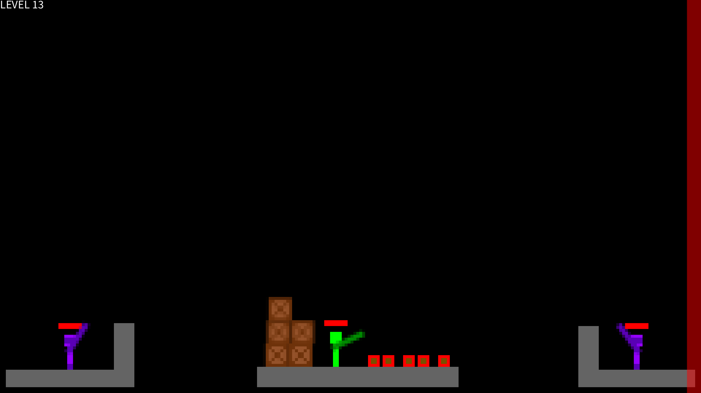

# Game: Infernoxene

## Concept statement

This is a 2D pixel side-scrolling action puzzle game where you burn all the enemies to death by utilizing flammable oil and other objects on the map. It includes a mix of rigid body and falling sand physics to provide a physics-based immersive gameplay experience.

## Generative rules

### Inspiration

The real-life inspired aspect of this game is basically the amount of ways that you can tackle a problem (or, more specifically, kill someone) in real life compared to, for example, in an FPS game where you can only shoot the enemies to death. This game chose to specifically focus on the aspect of fire propagation and physics and how they could be used as weapons to deal with the enemies.

The video game inspirations is most directly Noita, a game where every pixel is simulated. There are also inspirations from games like Dark Messiah of Might and Magic and Half-life 2 where physics play an important role. The lethality of fire in Far Cry 2 is also an inspiration.

### Gameplay

#### Starting point

You play as a character who can move up, down, left, and right in a given map. You can grab and throw objects and also cast sparks to light up flammable substances.

#### Objectives

Burn all the enemies to death while not getting caught up in the flames yourself.

#### Rules

Both the player and the enemy can move left and right, jump and "fast fall". Touching burning substance decreases both the player and the enemy's health. Both the player and the enemy die when they run out of the health.

The rigid bodies in the game world obey conservation of momentum except when external forces are applied. They could crash into each other and are under the influence of gravity and friction. The fluids are simulated through falling sand cellular automata rules (which doesn't fully obey rules in the real world). Fire is ignited by spark and are propagated through flammable substances.

### Core mechanics and loop

Player move push and throw objects around and cast oil bottles to create a way to set enemies on fire. They can cast a spark to set oil on fire to damage the enemies while avoid receiving damage themselves. Simultaneously, objects can also be used as obstacles for the player to defend themself from fire damage or to obstruct the enemies from throwing objects.

### Anticipated player experience

Players would be thrilled in the brutal termination of the enemies while engaging in the intellectual problem-solving process of making the best of what they have on the map and to utilize the physics to conduct this process creatively.

## Iterative process

### Iteration 1

I begin by implementing a basic falling sand simulation for water. This is done through simple cellular automata rules where each water pixel could move downward (including diagonally downward) and sideways during each simulation frame.

{width=10cm}

### Iteration 2

A fail attempt at simulating every pixel with Brownian motion, surface tension, and pressure. I thought up some ungrounded ways to simulate these rules, which did not work well. Therefore, I went back to the basic approach afterwards.

{width=10cm}

### Iteration 3

Add oil into the fluid simulation. It can also interact with water by having each oil pixel moving up when contacting with water. Note that in the final game I did not include water at all as my time have ran out, but there are potential ways in which oil-water interaction could be implemented.

{width=10cm}

### Iteration 4

Add rigid bodies that cannot move yet. They will however interact with liquids by displacing all the pixels that share the same space.

{width=10cm}

### Iteration 5

Add collision detection and resolution concerning rigid bodies and the map border. More details are explained below.

{width=10cm}

### Iteration 6

Add collision between rigid bodies. Each rigid body is modeled as connected squares, but the edges of a rigid body have the shape a series of circles. This could be understood as this:
```
oooo
o##o
o##o
oooo
```
For a rigid body of square shape.

The collision between rigid bodies are then resolved using a hand-made sequential impulse solver.

{width=10cm}

### Iteration 7

Add textured sprites. I have used the components pattern from Game Programming Patterns to organize each game object, where each GameObject class would be consisted of a Sprite, a Input, a Logic, and a body.

{width=10cm}

### Iteration 8

Add controllable player.

{width=10cm}

### Iteration 9

Add oil bottles that break on hard impact and release oil.

{width=10cm}

### Iteration 10

Add enemies that move around randomly. Oil can now be ignited with sparks and that fire will spread within oil. Player and enemy will die instantly upon contact with burning oil.

{width=10cm}

### Iteration 11

Add health bar and that contact with burning oil is not a one-hit kill anymore, but will decrease the health of the agent that comes into contact with it proportionally.

{width=10cm}

### Iteration 12

The ability to throw objects and cast spark are implemented.

{width=10cm}

### Iteration 13

A actual level editor is implemented. You may preview objects in the level editor. Level loading and saving are also implemented through manual serialization of GameObject.

{width=10cm}

### Iteration 14

Add decorative and solid pixels in falling sand simulation. Add plank object.

{width=10cm}

### Iteration 15

Add level exit at the right side of the screen where you may exit the level by entering it while all enemies are dead.

{width=10cm}

### Iteration 16

Add sentry, which is a type of enemy that stays still and cast oil bottle and spark alternatively continously.

{width=10cm}

## Final result

### Level 0

Title screen and introduction to basic movement.

{width=10cm}

### Level 1

Introduction to the spark casting and fire propagation mechanics. The player must use spark to ignite the oil pool and burn all the enemies to death.

{width=10cm}

### Level 2

Introduction to how the velocity of the spark projectile is relative to your movement velocity.

{width=10cm}

### Level 3

This level requires the player to run, jump, and cast spark.

{width=10cm}

### Level 4

This level introduces the grabbing mechanic and how you can push objects.

{width=10cm}

### Level 5

This level introduces how a rigid body blocks the flow of liquid.

{width=10cm}

### Level 6

It demonstrates how oil bottle works: How you can throw it and how it shatters on impact.

{width=10cm}

### Level 7

This level further tests the players ability to utilize bottle throwing, spark casting, and other mechanics previously introduced.

{width=10cm}

### Level 8

This level shows how you can make a ramp using a tilted plank.

{width=10cm}

### Level 9

This level demonstrates how you can remove the boxes to retrieve the bottles before using them as weapons.

{width=10cm}

### Level 10

Introduction to the sentry enemy type.

{width=10cm}

### Level 11

The player is challenged to defeating the sentry using oil bottles.

{width=10cm}

### Level 12

The player could try blocking the flow of sentry's oil to have it burn itself to death.

{width=10cm}

### Level 13

A very difficult challenge where the player has to face two sentries simultaneously while the burning oil builds up.

{width=10cm}

### Level 14

This level demonstrates that the player can hold on to the plank to escape the burning oil.

{width=10cm}

### Level 15

A randomly arranged final level.

{width=10cm}

## Controls

* P: Restart
* \` (The key above tab): Toggle playing/editor
* Enter: Screenshot

### Playing

* WASD: Movement
* Left mouse button: Grab
* Right mouse button: Cast spark
* Drag mouse: Move arm

### Editor

* Select the object to place:  
    1: Solid  
    2: Oil  
    3: Box  
    4: Plank  
    5: Oil bottle  
    6: Spark  
    7: Player  
    8: Enemy  
    9: Sentry  
    0: Decoration
* Backspace: Deletion tool for falling sand
* Tab: Save level
* Left/right arrow: Previous/next level

## Notes

* Do try the editor mode to play it like a sandbox or to skip levels!
* The written from scratch physics engine is really clunky...

## References

* https://www.youtube.com/watch?v=prXuyMCgbTc
* https://gameprogrammingpatterns.com
* https://www.cs.ubc.ca/~rhodin/2020_2021_CPSC_427/lectures/D_CollisionTutorial.pdf
* https://box2d.org/files/ErinCatto_SequentialImpulses_GDC2006.pdf
