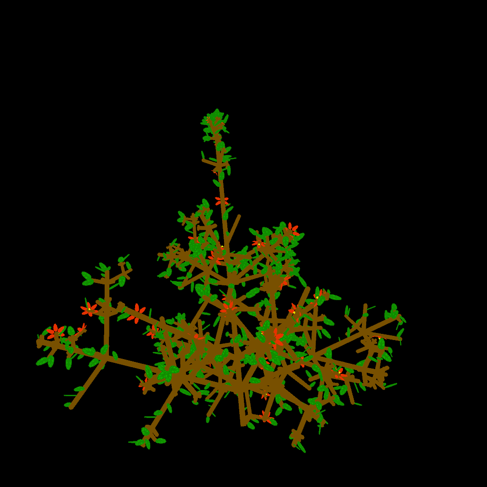

# Abstract 3D Plant Based on L-system (Extra Credit for Week 6)

## Concept

The main goal of this project is to create a basic semi-realistic model of plants with L-system. L-system represents a plant with a string where each character is a component. This string is then drawn in a fashion similar to turtle graphics. The plant is "grown" by replacing the characters in the string according to certain rules that are modeled after the real-life cell division and elongation events that occur during plant growth.

## Generative rule

L-system is a parallel rewriting system where a string representing the components are replaced simultaneously in each iteration according to certain rules. The string of components will be read from left to right and drawn. An imaginary "cursor" would represent the origin and the orientation for the current component to be drawn, which would also be updated after drawing the current component. Parentheses are used to store the cursor states on a stack to allow drawing branches. The components of this L-system would be the branches, leaves, flowers, and the apices where the new branches, leaves, and flowers are created (due to them being the places where cell divisions occur).

In this project, the process of planet growth will be animated. Therefore, rewriting will occur each frame where the new components are created from apices and that the existing components will also grow accordingly (cell elongation). The rules for rewriting will be stochastic, so that a apex might be replaced by different components probabilistically in each iteration.

The branches, leaves, and flowers are abstract shapes in this project. The configuration (for example, how many branches the apex might create each time) and the rewriting rules are static. Randomizing these rules and adding more details like branch textures are wind animations could be a project for the future.

### Vocabulary and rules

* A: apex
* B: branch
* L: leaf
* F: flower

The following replacements will happen probabilistically in each iteration:

* A -> BA
* A -> BLA
* A -> BFA
* A -> B(BA)(BA)...(BA)A

The existing components will also grow in size if possible.

## Iterative process

### Iteration 1

Implementing the utilities for drawing a branch and rotating the coordinate space with mouse

{width=10cm}

### Iteration 2

A basic L-system with only rough prototypes of branches and leaves. It is unrealistic as branching does not happen only in apices.

{width=10cm}

### Iteration 3

Relatively more detailed flowers and leaves are added. Leaves and petals are drawn as triangle fans fitted to unevenly squashed circles. Branching now only occurs at apices.

{width=10cm}

## Final result

Configurations are tweaked slightly for the plant growth animation. Lateral branches now grow more slowly just like real plants (though this also reduces the computational workload).

{width=10cm}
{width=10cm}
{width=10cm}

## References

L-system: Prusinkiewicz, P., & Lindenmayer, A. (2012). _The algorithmic beauty of plants_. Springer Science & Business Media.  
Cylinder drawing: https://vormplus.be/full-articles/drawing-a-cylinder-with-processing
